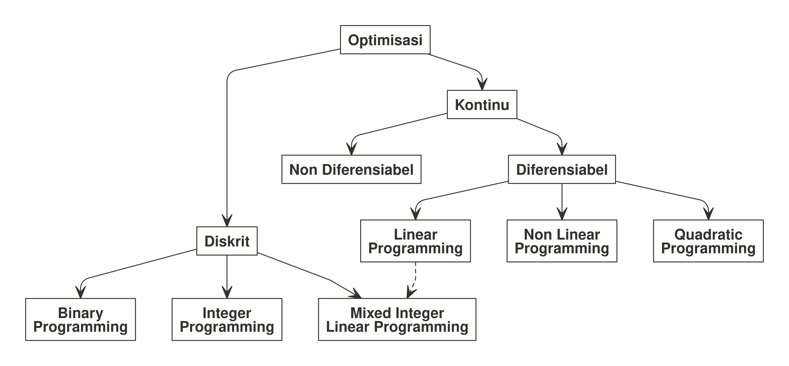
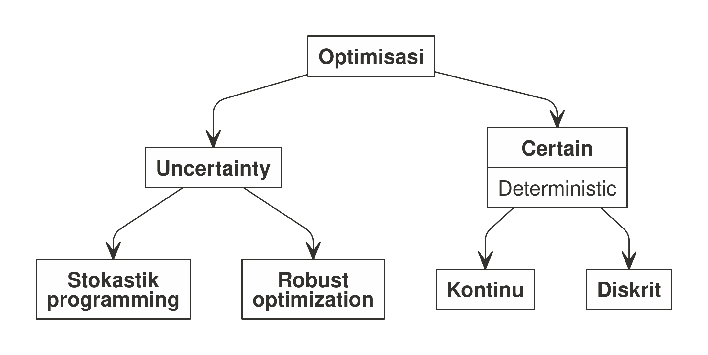
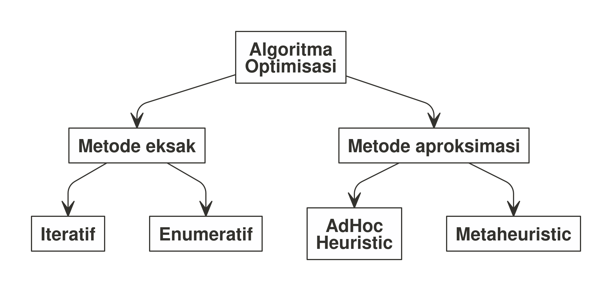

# PENGANTAR OPTIMISASI DALAM INDUSTRI


- [SEJARAH](#sejarah)
  - [Optimisasi](#optimisasi)
  - [Riset Operasi](#riset-operasi)
- [OPTIMISASI](#optimisasi-1)
  - [Bahasan dalam Optimisasi](#bahasan-dalam-optimisasi)
  - [Masalah Optimisasi](#masalah-optimisasi)
  - [Jenis-Jenis Masalah Optimisasi](#jenis-jenis-masalah-optimisasi)
- [JENIS OPTIMISASI](#jenis-optimisasi)
  - [*Linear Programming*](#linear-programming)
    - [Contoh Masalah *Linear
      Programming*](#contoh-masalah-linear-programming)
  - [*Integer Programming*](#integer-programming)
    - [Contoh *Integer Programming*](#contoh-integer-programming)
      - [Jadwal Kebutuhan Tenaga
        Kesehatan](#jadwal-kebutuhan-tenaga-kesehatan)
  - [*Binary Programming*](#binary-programming)
    - [Contoh *Binary Programming*](#contoh-binary-programming)
      - [Jadwal Tatap Muka Terbatas
        Sekolah](#jadwal-tatap-muka-terbatas-sekolah)
  - [*Mixed Integer Linear
    Programming*](#mixed-integer-linear-programming)
    - [Menyelesaikan *MILP*](#menyelesaikan-milp)
    - [Contoh *MILP*](#contoh-milp)
      - [Pemilihan dan Penentuan Item
        Produksi](#pemilihan-dan-penentuan-item-produksi)
- [ALGORITMA PENYELESAIAN
  OPTIMISASI](#algoritma-penyelesaian-optimisasi)
  - [*Exact Method*](#exact-method)
  - [*Approximate Method*](#approximate-method)
- [**R** UNTUK OPTIMISASI](#r-untuk-optimisasi)
  - [`ompr` *Packages* di **R**](#ompr-packages-di-r)
    - [`ompr` *Modelling*](#ompr-modelling)
      - [*Decision Variable*](#decision-variable)
      - [*Objective Function* dan
        *Constraints*](#objective-function-dan-constraints)
      - [Contoh Penyelesaian *Mixed Integer Linear
        Programming*](#contoh-penyelesaian-mixed-integer-linear-programming)
      - [*Conclusion*](#conclusion)
    - [Penyelesaian Masalah **Jadwal Kebutuhan Tenaga
      Kesehatan**](#penyelesaian-masalah-jadwal-kebutuhan-tenaga-kesehatan)
    - [Penyelesaian Masalah **Jadwal Tatap Muka Terbatas
      Sekolah**](#penyelesaian-masalah-jadwal-tatap-muka-terbatas-sekolah)
    - [Penyelesaian Masalah **Pemilihan dan Penentuan Item
      Produksi**](#penyelesaian-masalah-pemilihan-dan-penentuan-item-produksi)
  - [*Spiral Optimization Algorithm*](#spiral-optimization-algorithm)
    - [Ilustrasi Geometris](#ilustrasi-geometris)
      - [Operasi Matriks Rotasi](#operasi-matriks-rotasi)
      - [Operasi Matriks Rotasi dan
        Kontraksi](#operasi-matriks-rotasi-dan-kontraksi)
      - [Operasi Matriks Rotasi dan Kontraksi dengan Titik
        
        Sebagai
        Pusatnya](#operasi-matriks-rotasi-dan-kontraksi-dengan-titik-x-sebagai-pusatnya)
    - [Program *Spiral Optimization
      Algorithm*](#program-spiral-optimization-algorithm)
      - [Contoh Penggunaan Program](#contoh-penggunaan-program)
    - [Matriks Rotasi untuk n-Dimensi](#matriks-rotasi-untuk-n-dimensi)
    - [*Function* Matriks Rotasi](#function-matriks-rotasi)
    - [*MILP* dengan *Dynamic Spiral Optimization
      Algorithm*](#milp-dengan-dynamic-spiral-optimization-algorithm)
    - [Penyelesaian *MILP*](#penyelesaian-milp)

# SEJARAH

## Optimisasi

Optimisasi adalah **proses mencari nilai yang optimal** dari suatu
masalah tertentu. Dalam matematika, optimisasi merujuk pada pencarian
nilai minimal atau maksimal dari suatu *fungsi real*[^1]. Notasi
matematikanya dapat ditulis sebagai berikut:

Misalkan suatu fungsi 
yang memetakan dari himpunan
 ke bilangan *real*.


Cari suatu nilai

sedemikian sehingga:

-  \leq f(x), \forall x \in A")
  untuk proses **minimalisasi**.
-  \geq f(x), \forall x \in A")
  untuk proses **maksimalisasi**.

Di dalam kalkulus, kita mengetahui salah satu pendekatan optimisasi di
fungsi satu variabel bisa didapatkan dari turunan pertama yang bernilai
**nol** (bisa berupa nilai maksimum atau minimum dari fungsi tersebut).

Nilai
![x_0 \in \[a,b\]](https://latex.codecogs.com/svg.latex?x_0%20%5Cin%20%5Ba%2Cb%5D "x_0 \in [a,b]")
disebut minimum atau maksimum di
 unimodal saat memenuhi:

 = 0")

**Pierre De Fermat** dan **Joseph-Louis Lagrange** adalah orang-orang
yang pertama kali menemukan formula kalkulus untuk mencari nilai
optimal. Sementara **Isaac Newton** dan **Johann C. F.Gauss**
mengusulkan metode iteratif untuk mencari nilai optimal[^2].

Salah satu bentuk optimisasi yakni *linear programming* dimulai oleh
**Leonid Kantorovich** pada 1939. **Metode Simplex** merupakan salah
satu metode penyelesaian optimisasi yang terkenal, pertama kali
diperkenalkan pada 1947 oleh **George Dantzig** sementara di tahun yang
sama *Theory of Duality* diperkenalkan oleh **John von Neumann**.

## Riset Operasi

**Riset operasi** adalah metode antar disiplin ilmu yang digunakan untuk
menganalisa masalah nyata dan membuat keputusan untuk kegiatan
operasional organisasi atau perusahaan[^3].

Riset operasi dimulai pada era Perang Dunia II. Oleh karena peperangan,
diperlukan suatu cara yang efektif untuk mengalokasikan *resources* yang
ada sehingga pihak militer Inggris dan Amerika Serikat mengumpulkan
ilmuwan-ilmuwan untuk mencari pendekatan yang saintifik dalam memecahkan
masalah.

Pada tahun 1940, sekelompok *researchers* yang dipimpin oleh **PMS
Blackett** dari ***the University of Manchester*** melakukan studi
tentang **Sistem Radar Baru Anti Pesawat Terbang**. Kelompok
*researchers* ini sering dijuluki sebagai **Kelompok Sirkus Blackett**
(*Blackett’s circus*). Julukan ini terjadi karena keberagaman latar
belakang disiplin ilmu para *researchers* tersebut. Mereka terdiri dari
disiplin ilmu fisiologi, matematika, astronomi, tentara, surveyor, dan
fisika. Pada 1941, kelompok ini terlibat dalam penelitian radar deteksi
kapal selam dan pesawat terbang. *Blackett* kemudian memimpin *Naval
Operational Research* pada Angkatan Laut Kerajaan Inggris Raya.
Prinsip-prinsip ilmiah yang digunakan untuk mengambil keputusan dalam
suatu operasi dinamai sebagai **Riset Operasi**.

Saat Amerika Serikat mulai terlibat pada Perang Dunia II, prinsip riset
operasi juga digunakan untuk berbagai operasi militer mereka. Kelompok
riset operasi AS bertugas untuk menganalisis serangan udara dan laut
tentara NAZI Jerman.

Selepas Perang Dunia II, penerapan riset operasi dinilai bisa diperluas
ke dunia ekonomi, bisnis,*engineering*, dan sosial. Riset operasi banyak
berkaitan dengan berbagai disiplin ilmu seperti matematika, statistika,
*computer science*, dan lainnya. Tidak jarang beberapa pihak menganggap
riset operasi itu *overlapping* dengan disiplin-disiplin ilmu tersebut.

Oleh karena tujuan utama dari aplikasi riset operasi adalah tercapainya
**hasil yang optimal** dari semua kemungkinan perencanaan yang dibuat.
Maka **pemodelan matematika dan optimisasi** bisa dikatakan sebagai
disiplin utama dari riset operasi.

# OPTIMISASI

## Bahasan dalam Optimisasi

Bahasan dalam optimisasi dapat dikategorikan menjadi:

- Pemodelan masalah nyata menjadi masalah optimisasi.
- Pembahasan karakteristik dari masalah optimisasi dan keberadaan solusi
  dari masalah optimisasi tersebut.
- Pengembangan dan penggunaan algoritma serta analisis numerik untuk
  mencari solusi dari masalah tersebut.

## Masalah Optimisasi

**Masalah optimisasi** adalah masalah matematika yang mewakili masalah
nyata (*real*). Dari ekspresi matematika tersebut, ada beberapa hal yang
perlu diketahui[^4], yakni:

1.  **Variabel** adalah suatu simbol yang memiliki banyak nilai dan
    nilainya ingin kita ketahui. Setiap nilai yang mungkin dari suatu
    variabel muncul akibat suatu kondisi tertentu di sistem.
2.  **Parameter** di suatu model matematika adalah suatu konstanta yang
    menggambarkan suatu karakteristik dari sistem yang sedang diteliti.
    Parameter bersifat *fixed* atau *given*.
3.  ***Constraints*** (atau kendala) adalah kondisi atau batasan yang
    harus dipenuhi. Kendala-kendala ini dapat dituliskan menjadi suatu
    persamaan atau pertaksamaan. Suatu masalah optimisasi dapat memiliki
    hanya satu kendala atau banyak kendala.
4.  ***Objective function*** adalah satu fungsi (pemetaan dari
    variabel-varibel keputusan ke suatu nilai di daerah *feasible*) yang
    nilainya akan kita minimumkan atau kita maksimumkan.

Ekspresi matematika dari model optimisasi adalah sebagai berikut:

> Cari  yang
> meminimumkan
> ") dengan
> kendala
>  = 0, h(x) \leq 0")
> dan
> .

Dari ekspresi tersebut, kita bisa membagi-bagi masalah optimisasi
tergantung dari:

1.  Tipe variabel yang terlibat.
2.  Jenis fungsi yang ada (baik *objective function* ataupun
    *constraints*).

## Jenis-Jenis Masalah Optimisasi

Masalah optimisasi bisa dibagi dua menjadi dua kategori berdasarkan tipe
*variables* yang terlibat[^5], yakni:



1.  *Discrete Optimization*: merupakan masalah optimisasi di mana
    variabel yang terkait merupakan variabel diskrit, seperti *binary*
    atau *integer* (bilangan bulat). Namun pada masalah optimisasi
    berbentuk *mixed integer linear programming*, dimungkinkan suatu
    masalah optimisasi memiliki berbagai jeni variabel yang terlibat
    (integer dan kontinu sekaligus).
2.  *Continuous Optimization*: merupakan masalah optimisasi di mana
    variabel yang terkait merupakan variabel kontinu (bilangan *real*).
    Pada masalah optimisasi jenis ini, fungsi-fungsi yang terlibat bisa
    diferensiabel atau tidak. Konsekuensinya adalah pada metode
    penyelesaiannya.

Selain itu, kita juga bisa membagi masalah optimisasi berdasarkan
**kepastian nilai** ***variable*** **dan parameter** yang dihadapi
sebagai berikut:



1.  *Optimization under uncertainty*[^6]; Pada beberapa kasus di dunia
    *real*, data dari masalah tidak dapat diketahui secara akurat karena
    berbagai alasan. Hal ini mungkin terjadi akibat:
    - Kesalahan dalam pengukuran, atau
    - Data melibatkan sesuatu di masa depan yang belum terjadi atau
      tidak pasti. Contoh: *demand* produk, harga barang, dan
      sebagainya.
2.  *Deterministic optimization*;
    - Model deterministik adalah model matematika di mana nilai dari
      semua parameter dan variabel yang terkandung di dalam model
      merupakan satu nilai pasti[^7].
    - Pendekatan deterministik memanfaatkan sifat analitik masalah untuk
      menghasilkan barisan titik yang konvergen ke solusi optimal.
    - Semua algoritma perhitungan mengikuti pendekatan matematis yang
      ketat.

# JENIS OPTIMISASI

## *Linear Programming*

*Linear programming* adalah bentuk metode optimisasi sederhana yang
memanfaatkan relasi linear (semua fungsi dan *constraints* merupakan
fungsi linear).

### Contoh Masalah *Linear Programming*

Saya memiliki area parkir seluas 1.960
. Luas rata-rata
untuk mobil berukuran kecil adalah 4
 dan mobil besar
adalah 20 . Daya
tampung maksimum hanya 250 kendaraan, biaya parkir mobil kecil adalah Rp
7.000 per jam dan mobil besar adalah Rp 12.000 per jam. Jika dalam 1 jam
area parkir saya terisi penuh dan tidak ada kendaraan yang pergi dan
datang, maka berapa pendapatan maksimum yang bisa saya dapatkan dari
tempat parkir itu?

Dari kasus di atas kita bisa tuliskan model matematikanya sebagai
berikut:

Misal  adalah
mobil kecil dan 
adalah mobil besar.

")

Dengan *constraints*:


dan


serta
.

## *Integer Programming*

*Integer programming* adalah bentuk metode optimisasi di mana variabel
yang terlibat merupakan bilangan bulat (*integer*). Jika fungsi-fungsi
yang terkait merupakan *linear*, maka disebut dengan *integer linear
programming*.

Sebagai contoh, variabel yang merupakan bilangan bulat adalah banyak
orang.

### Contoh *Integer Programming*

#### Jadwal Kebutuhan Tenaga Kesehatan

Suatu rumah sakit membutuhkan tenaga kesehatan setiap harinya dengan
spesifikasi berikut:

|  hari  | Min Nakes Required | Max Nakes Required |
|:------:|:------------------:|:------------------:|
| Senin  |         24         |         29         |
| Selasa |         22         |         27         |
|  Rabu  |         23         |         28         |
| Kamis  |         11         |         16         |
| Jumat  |         16         |         21         |
| Sabtu  |         20         |         25         |
| Minggu |         12         |         17         |

Tabel Kebutuhan Nakes Harian

Di rumah sakit tersebut berlaku kondisi sebagai berikut:

1.  Setiap nakes hanya diperbolehkan bekerja selama 5 hari
    berturut-turut dan harus libur selama 2 hari berturut-turut.
2.  Tidak ada pemberlakuan *shift* bagi nakes.

Berapa banyak nakes yang harus dipekerjakan oleh rumah sakit tersebut?
Bagaimana konfigurasi penjadwalannya?

Untuk memudahkan dalam mencari solusi permasalahan di atas, kita bisa
membuat tabel ilustrasi berikut:

|  hari  | Min Nakes Required | Max Nakes Required | x1  | x2  | x3  | x4  | x5  | x6  | x7  |
|:------:|:------------------:|:------------------:|:---:|:---:|:---:|:---:|:---:|:---:|:---:|
| Senin  |         24         |         29         |  x  |     |     |  x  |  x  |  x  |  x  |
| Selasa |         22         |         27         |  x  |  x  |     |     |  x  |  x  |  x  |
|  Rabu  |         23         |         28         |  x  |  x  |  x  |     |     |  x  |  x  |
| Kamis  |         11         |         16         |  x  |  x  |  x  |  x  |     |     |  x  |
| Jumat  |         16         |         21         |  x  |  x  |  x  |  x  |  x  |     |     |
| Sabtu  |         20         |         25         |     |  x  |  x  |  x  |  x  |  x  |     |
| Minggu |         12         |         17         |     |     |  x  |  x  |  x  |  x  |  x  |

Konfigurasi Penjadwalan Nakes

Kolom

menandakan kelompok nakes yang perlu dipekerjaan pada hari-hari
tertentu. Setiap nilai
 tersebut
merupakan **bilangan bulat positif**
.

Dari ilustrasi di atas, kita bisa membuat model optimisasinya sebagai
berikut:

***Objective Function***


***Constraints***

- Hari Senin:
  .
- Hari Selasa:
  .
- Hari Rabu:
  .
- Hari Kamis:
  .
- Hari Jumat:
  .
- Hari Sabtu:
  .
- Hari Minggu:
  .

Kita juga perlu perhatikan bahwa
.

## *Binary Programming*

*Binary programming* adalah bentuk metode optimisasi di mana variabel
yang terlibat merupakan bilangan biner (0,1). Biasanya metode ini
dipakai dalam masalah penjadwalan yang memerlukan prinsip *matching*
antar kondisi yang ada.

### Contoh *Binary Programming*

#### Jadwal Tatap Muka Terbatas Sekolah

Beberapa minggu ke belakang, kasus harian Covid semakin menurun.
Pemerintah mulai melonggarkan aturan PPKM yang mengakibatkan
sekolah-sekolah mulai menggelar pengajaran tatap muka terbatas (PTMT)
untuk siswanya secara *offline*.

Suatu sekolah memiliki kelas berisi 20 orang siswa. Mereka hendak
menggelar PTMT dengana aturan sebagai berikut:

1.  PTMT digelar dari Senin hingga Jumat (5 hari).
2.  Dalam sehari, siswa yang boleh hadir dibatasi 4-8 orang saja.
3.  Dalam seminggu, diharapkan siswa bisa hadir 2-3 kali.
4.  Siswa yang hadir di selang sehari baru bisa hadir kembali.

Dari uraian di atas, kita bisa membuat model optimisasinya sebagai
berikut:

Saya definisikan
")
sebagai bilangan biner di mana

menandakan siswa dan

menandakan hari. Berlaku:


***Objective Function***

Tujuan utama kita adalah memaksimalkan siswa yang hadir.


***Constraints***

Dalam sehari, ada pembatasan jumlah siswa yang hadir.


Dalam seminggu, siswa hadir dalam frekuensi tertentu.


Ada jeda sehari agar siswa bisa masuk kembali.


Jangan lupa bahwa
.

## *Mixed Integer Linear Programming*

Pada bagian sebelumnya, kita telah membahas masalah optimisasi dengan
variabel berupa diskrit dan kontinu. Permasalahan *real* yang ada di
kehidupan sehari-hari biasanya merupakan memiliki variabel yang *mixed*
antara keduanya. Oleh karena itu, ada metode yang disebut dengan *mixed
integer linear programming*. Pada masalah optimisasi tipe ini, *decision
variables* yang terlibat bisa saja berupa *binary*, *integer*, dan
*continuous* sekaligus.

### Menyelesaikan *MILP*

*MILP* secara eksak bisa diselesaikan dengan metode *simplex* dengan
dikombinasikan dengan teknik *branch and bound*. Penjelasan terkait ini
akan dibahas pada bab `6`.

### Contoh *MILP*

#### Pemilihan dan Penentuan Item Produksi

Suatu pabrik makanan dan minuman berencana untuk membuat tiga produk
baru yang bisa diproduksi di dua *plants* yang berbeda.

| Produk | Runtime Plant 1 | Runtime Plant 2 |
|:-------|----------------:|----------------:|
| Item 1 |               3 |               4 |
| Item 2 |               4 |               6 |
| Item 3 |               2 |               2 |

Tabel Runtime Item Produk per Plant (harian - dalam jam)

**Plant 1** memiliki maksimum *working hours* sebesar 30 jam perhari.

**Plant 2** memiliki maksimum *working hours* sebesar 40 jam perhari.

| Produk | Profit per ton | Sales potential per ton |
|:-------|---------------:|------------------------:|
| Item 1 |              5 |                       7 |
| Item 2 |              7 |                       5 |
| Item 3 |              3 |                       9 |

Tabel Profit dan Potensi Sales Item Produk

Masalah timbul saat mereka harus memilih **dua dari tiga** produk baru
tersebut yang harus di produksi. Selain itu, mereka juga harus memilih
**satu dari dua** *plants* yang memproduksi *items* tersebut.

Misalkan saya definisikan:

- 
  sebagai `berapa ton` yang harus diproduksi dari item
  .
- ![y_i \in \[0,1\], i = 1,2,3](https://latex.codecogs.com/svg.latex?y_i%20%5Cin%20%5B0%2C1%5D%2C%20i%20%3D%201%2C2%2C3 "y_i \in [0,1], i = 1,2,3")
  sebagai *binary*.
  - Jika bernilai 0, maka produk
     tidak dipilih.
  - Jika bernilai 1, maka produk
     dipilih.
- ![z \in \[0,1\]](https://latex.codecogs.com/svg.latex?z%20%5Cin%20%5B0%2C1%5D "z \in [0,1]")
  sebagai *binary*.
  - Jika bernilai 0, maka *plant* pertama dipilih.
  - Jika bernilai 1, maka *plant* kedua dipilih.

Saya akan mendefinisikan suatu variabel *dummy*

berisi suatu nilai yang besar. Kelak variabel ini akan berguna untuk
*reinforce model* (metode pemberian *penalty*) agar bisa memilih *items*
dan *plants* secara bersamaan.

***Objective function*** dari masalah ini adalah memaksimalkan *profit*.


***Constraints*** dari masalah ini adalah:

Tonase produksi tidak boleh melebihi angka *sales potential* per items.


Kita akan memilih dua produk sekaligus menghitung tonase. Jika produk
tersebut **dipilih**, maka akan ada angka tonase produksinya.
Sebaliknya, jika produk tersebut **tidak dipilih**, maka tidak ada angka
tonase produksinya.


Kita akan memilih *plant* dari waktu produksinya.


# ALGORITMA PENYELESAIAN OPTIMISASI

Pada bagian ini kita akan membahas macam-macam algoritma yang digunakan
untuk menyelesaikan masalah optimisasi.



Secara garis besar ada dua kelompok besar algoritma optimisasi, yakni:

1.  *Exact method*,
2.  *Approximate method*.

Perbedaan keduanya adalah pada **konsep atau pendekatan apa yang
digunakan** untuk menyelesaikan masalah optimisasi. Kita akan bahas
satu-persatu pada bagian selanjutnya.

Dalam beberapa kasus, kita bisa mendapatkan *exact method* bisa untuk
menyelesaikan masalah optimisasi dengan efisien. Namun di kasus lain
yang lebih kompleks tidak demikian. Kelemahan utama metode *exact*
adalah pada waktu komputasinya yang relatif lebih lama.

## *Exact Method*

Ciri khas dari *exact method* adalah metode ini menjamin penyelesaian
yang optimal karena menggunakan pendekatan analitis \[@franz\]. Salah
satu contoh metode eksak adalah *Simplex Method*.

## *Approximate Method*

Ciri khas dari *approximate method* adalah metode ini tidak menjamin
penyelesaian yang optimal karena bersifat *aproksimasi* atau pendekatan
atau hampiran. Oleh karena itu kita perlu melakukan definisi di awal
**seberapa dekat** nilai **hampiran** tersebut bisa kita terima.

Metode ini bisa dibagi menjadi dua berdasarkan keterkaitannya dengan
suatu masalah, yakni:

1.  *Heuristic*, metode ini bersifat *problem dependent*. Artinya metode
    tersebut hanya bisa dipakai untuk jenis permasalahan tertentu.
    - Contoh: metode *nearest neighborhood* hanya bisa dipakai untuk
      menyelesaikan masalah dalam lingkup *travelling salesperson
      problem* (**TSP**).
2.  *Meta heuristic*, metode ini bersifat *problem independent*. Artinya
    metode tersebut tidak tergantung dari jenis permasalahan tertentu.
    Contoh:
    - *Genetic algorithm*.
    - *Simulated annealing*.
    - *Spiral optimization* untuk menyelesaikan masalah *mixed integer
      non linear programming*.
    - *Artifical bee colony algorithm*.

Namun demikian kedua metode ini bisa saling melengkapi dalam prakteknya.

# **R** UNTUK OPTIMISASI

Untuk menyelesaikan masalah optimisasi menggunakan **R**, ada beberapa
cara yang bisa digunakan, yakni:

1.  Menggunakan `ompr` *packages*.
2.  Membuat algoritma *dynamic spiral*.
3.  Menggunakan Google OR Tools[^8].

## `ompr` *Packages* di **R**

Ada satu *packages* lain di **R** yang bisa digunakan untuk
menyelesaikan masalah optimisasi, yakni bernama `ompr`. *Packages*
`ompr` dibuat oleh **Dirk Schumacher** pada 2018[^9].

Salah satu keuntungan dari *library* ini adalah pengunaan operator
*pipe* `%>%` pada perumusan algoritmanya. Sehingga bagi *user* yang
biasa menggunakan prinsip `tidyverse` akan merasa sangat terbantu.

### `ompr` *Modelling*

*Framework* untuk menuliskan model optimisasi menggunakan `ompr` adalah
sebagai berikut:

    # mulai membangun model
    MIPModel() %>% 
      
      # menambah variabel
      add_variable() %>% 
      
      # set objective
      set_objective() %>% 
      
      # menambah constraints
      add_constraint()

#### *Decision Variable*

harus didefinisikan sejak awal. Ada berapa dan tipenya seperti apa. Kita
bisa menggunakan *indexed variables* untuk menghemat notasi. Berikut
adalah contohnya:

    MIPModel() %>% 

      # menambah variabel integer
      add_variable(x, type = "integer") %>% 
      
      # menambah variabel kontinu
      add_variable(y, type = "continuous") %>% 
      
      # menambah variabel binary integer
      add_variable(z, type = "binary") %>% 
      
      # menambah variabel dengan lower bound
      add_variable(x, lb = 10) %>% 
      
      # menambah variabel dengan upper dan lower bounds
      add_variable(y, lb = 5, ub = 10) %>% 
      
      # menambah 10 variabel berindeks
      add_variable(p[i], i = 1:10)

#### *Objective Function* dan *Constraints*

dalam `ompr` bisa dituliskan sebagai fungsi matematika biasa. Bahkan
kita bisa menuliskan *summation* ke dalam algoritmanya. Berikut adalah
contohnya:

Misal ada `3` variabel
,
dengan *objective function*

dengan *constraint*
.

    MIPModel() %>% 
      add_variable(x[i], i = 1:3) %>% 
      set_objective(sum_expr(x[i], i = 1:3)) %>% 
      add_constraint(sum_expr(x[i], i = 1:3) <= 7)

#### Contoh Penyelesaian *Mixed Integer Linear Programming*


Mari kita tuliskan dalam `ompr` *framework* berikut:

``` r
rm(list=ls())

# memanggil libraries
library(dplyr)
library(ompr)
library(ompr.roi)
library(ROI.plugin.glpk)

# membuat model
milp_new = 
  MIPModel() %>% 
  
  # membuat 2 variabel integer
  add_variable(x1,type = "integer",lb = 0) %>% 
  add_variable(x2,type = "integer",lb = 0) %>% 
  
  # membuat 1 variabel kontinu
  add_variable(x3,type = "continuous",lb = 0) %>% 
  
  # set obj function
  set_objective(7*x1 + 3*x2 + x3,
                "max") %>% 
  
  # menuliskan semua constraints
  add_constraint(6*x1 + 4*x2  + 5*x3 <= 60) %>% 
  add_constraint(8*x1 + x2 + 2*x3 <= 80) %>% 
  add_constraint(9*x1 + x2 + 7*x3 <= 70) 

milp_new
```

    Mixed integer linear optimization problem
    Variables:
      Continuous: 1 
      Integer: 2 
      Binary: 0 
    Model sense: maximize 
    Constraints: 3 

Mari kita *solve* modelnya:

``` r
result = solve_model(milp_new, with_ROI(solver = "glpk", verbose = TRUE))
```

    <SOLVER MSG>  ----
    GLPK Simplex Optimizer 5.0
    3 rows, 3 columns, 9 non-zeros
    *     0: obj =  -0.000000000e+00 inf =   0.000e+00 (3)
    *     2: obj =   6.333333333e+01 inf =   0.000e+00 (0)
    OPTIMAL LP SOLUTION FOUND
    GLPK Integer Optimizer 5.0
    3 rows, 3 columns, 9 non-zeros
    2 integer variables, none of which are binary
    Integer optimization begins...
    Long-step dual simplex will be used
    +     2: mip =     not found yet <=              +inf        (1; 0)
    +     4: >>>>>   6.140000000e+01 <=   6.166666667e+01   0.4% (2; 0)
    +     4: mip =   6.140000000e+01 <=     tree is empty   0.0% (0; 3)
    INTEGER OPTIMAL SOLUTION FOUND
    <!SOLVER MSG> ----

``` r
result
```

    Status: success
    Objective value: 61.4

Berikut adalah hasilnya:

``` r
result %>% get_solution(x1)
```

    x1 
     7 

``` r
result %>% get_solution(x2)
```

    x2 
     4 

``` r
result %>% get_solution(x3)
```

     x3 
    0.4 

#### *Conclusion*

Salah satu ciri khas `ompr` adalah penulisannya yang mirip dengan notasi
matematika sehingga saat kita memiliki suatu model dengan banyak
variabel, kita tidak perlu menginputnya ke dalam bentuk matriks.

### Penyelesaian Masalah **Jadwal Kebutuhan Tenaga Kesehatan**

Dengan menggunakan `library(ompr)`

``` r
rm(list=ls())

# memanggil libraries
library(dplyr)
library(ompr)
library(ompr.roi)
library(ROI.plugin.glpk)

# membuat model
integer_prog = 
  MIPModel() %>% 
  # membuat variabel
  add_variable(x[i],
               type = "integer",
               lb = 0,
               i = 1:7) %>% 
  # set fungsi objective
  set_objective(sum_expr(x[i],i = 1:7),"min") %>% 
  # memasukkan constraints
  # senin
  add_constraint(sum_expr(x[i], i = c(1,4,5,6,7)) >= 24) %>% 
  add_constraint(sum_expr(x[i], i = c(1,4,5,6,7)) <= 29) %>% 
  # selasa
  add_constraint(sum_expr(x[i], i = c(1,2,5,6,7)) >= 22) %>% 
  add_constraint(sum_expr(x[i], i = c(1,2,5,6,7)) <= 27) %>% 
  # rabu
  add_constraint(sum_expr(x[i], i = c(1,2,3,6,7)) >= 23) %>% 
  add_constraint(sum_expr(x[i], i = c(1,2,3,6,7)) <= 28) %>% 
  # kamis
  add_constraint(sum_expr(x[i], i = c(1,2,3,4,7)) >= 11) %>% 
  add_constraint(sum_expr(x[i], i = c(1,2,3,4,7)) <= 16) %>% 
  # jumat
  add_constraint(sum_expr(x[i], i = 1:5) >= 16) %>% 
  add_constraint(sum_expr(x[i], i = 1:5) <= 21) %>% 
  # sabtu
  add_constraint(sum_expr(x[i], i = 2:6) >= 20) %>% 
  add_constraint(sum_expr(x[i], i = 2:6) <= 25) %>% 
  # minggu
  add_constraint(sum_expr(x[i], i = 3:7) >= 12) %>% 
  add_constraint(sum_expr(x[i], i = 3:7) <= 17)

integer_prog
```

    Mixed integer linear optimization problem
    Variables:
      Continuous: 0 
      Integer: 7 
      Binary: 0 
    Model sense: minimize 
    Constraints: 14 

``` r
hasil = integer_prog %>% solve_model(with_ROI(solver = "glpk",verbose = T))
```

    <SOLVER MSG>  ----
    GLPK Simplex Optimizer 5.0
    14 rows, 7 columns, 70 non-zeros
          0: obj =   0.000000000e+00 inf =   1.280e+02 (7)
          9: obj =   2.766666667e+01 inf =   0.000e+00 (0)
    *    10: obj =   2.766666667e+01 inf =   0.000e+00 (0)
    OPTIMAL LP SOLUTION FOUND
    GLPK Integer Optimizer 5.0
    14 rows, 7 columns, 70 non-zeros
    7 integer variables, none of which are binary
    Integer optimization begins...
    Long-step dual simplex will be used
    +    10: mip =     not found yet >=              -inf        (1; 0)
    +    12: >>>>>   2.800000000e+01 >=   2.800000000e+01   0.0% (2; 0)
    +    12: mip =   2.800000000e+01 >=     tree is empty   0.0% (0; 3)
    INTEGER OPTIMAL SOLUTION FOUND
    <!SOLVER MSG> ----

``` r
# solusi yang dihasilkan
hasil$solution
```

    x[1] x[2] x[3] x[4] x[5] x[6] x[7] 
       8    3    1    0    4   12    0 

Kita telah mendapatkan konfigurasi jadwal nakes yang optimal perharinya.

### Penyelesaian Masalah **Jadwal Tatap Muka Terbatas Sekolah**

Dengan menggunakan `library(ompr)`

``` r
rm(list=ls())

library(dplyr)
library(ompr)
library(ompr.roi)
library(ROI.plugin.glpk)

bin_prog = 
  MIPModel() %>%
  # menambah variabel
  add_variable(x[i,j],
           i = 1:20,
           j = 1:5,
           type = "binary",
           lb = 0) %>%
  # membuat objective function
  set_objective(sum_expr(x[i,j],
             i = 1:20,
             j = 1:5),
        "max") %>%
  # menambah constraints
  # max kapasitas kelas
  add_constraint(sum_expr(x[i,j],i = 1:20) >= 4,
         j = 1:5) %>%
  add_constraint(sum_expr(x[i,j],i = 1:20) <= 8,
         j = 1:5) %>%
  # frek kunjungan siswa
  add_constraint(sum_expr(x[i,j],j = 1:5) >= 2,
         i = 1:20) %>%
  add_constraint(sum_expr(x[i,j],j = 1:5) <= 3,
         i = 1:20) %>%
  # jeda sehari
  add_constraint(x[i,j] + x[i,j+1] <= 1,
         i = 1:20,
         j = 1:4)

bin_prog 
```

    Mixed integer linear optimization problem
    Variables:
      Continuous: 0 
      Integer: 0 
      Binary: 100 
    Model sense: maximize 
    Constraints: 130 

Berikut adalah hasilnya:

    <SOLVER MSG>  ----
    GLPK Simplex Optimizer 5.0
    130 rows, 100 columns, 560 non-zeros
          0: obj =  -0.000000000e+00 inf =   6.000e+01 (25)
         51: obj =   4.000000000e+01 inf =   0.000e+00 (0)
    *    53: obj =   4.000000000e+01 inf =   0.000e+00 (0)
    OPTIMAL LP SOLUTION FOUND
    GLPK Integer Optimizer 5.0
    130 rows, 100 columns, 560 non-zeros
    100 integer variables, all of which are binary
    Integer optimization begins...
    Long-step dual simplex will be used
    +    53: mip =     not found yet <=              +inf        (1; 0)
    +    53: >>>>>   4.000000000e+01 <=   4.000000000e+01   0.0% (1; 0)
    +    53: mip =   4.000000000e+01 <=     tree is empty   0.0% (0; 1)
    INTEGER OPTIMAL SOLUTION FOUND
    <!SOLVER MSG> ----

| hari | presensi               |
|-----:|:-----------------------|
|    1 | 1,2,3,4,9,10,11,12     |
|    2 | 5,6,7,8,13,14,15,16    |
|    3 | 1,2,3,4,17,18,19,20    |
|    4 | 5,6,7,8,13,14,15,16    |
|    5 | 9,10,11,12,17,18,19,20 |

Jadwal Kunjungan Siswa

| siswa | jumlah kehadiran |
|------:|-----------------:|
|     1 |                2 |
|     2 |                2 |
|     3 |                2 |
|     4 |                2 |
|     5 |                2 |
|     6 |                2 |
|     7 |                2 |
|     8 |                2 |
|     9 |                2 |
|    10 |                2 |
|    11 |                2 |
|    12 |                2 |
|    13 |                2 |
|    14 |                2 |
|    15 |                2 |
|    16 |                2 |
|    17 |                2 |
|    18 |                2 |
|    19 |                2 |
|    20 |                2 |

Rekap Presensi Siswa

### Penyelesaian Masalah **Pemilihan dan Penentuan Item Produksi**

Dengan menggunakan `library(ompr)`

``` r
rm(list=ls())

library(dplyr)
library(ompr)
library(ompr.roi)
library(ROI.plugin.glpk)

# data yang dibutuhkan
profit = c(5,7,3)
sales = c(7,5,9)
M = 99999

# membuat model
mil_prog = 
  MIPModel() %>%
  # menambah variabel
  # xi
  add_variable(x[i],
           i = 1:3,
           type = "continuous",
           lb = 0) %>%
  # yi
  add_variable(y[i],
           i = 1:3,
           type = "binary",
           lb = 0) %>%
  # z
  add_variable(z,type = "binary",lb = 0) %>%
  # membuat objective function
  set_objective(sum_expr(x[i] * profit[i],
             i = 1:3),
        "max") %>%
  # menambah constraints
  # max tonase
  add_constraint(x[i] <= sales[i],
         i = 1:3) %>%
  # memilih 2 produk
  add_constraint(x[i] - y[i] * M <= 0,
         i = 1:3) %>%
  add_constraint(sum_expr(y[i],
         i = 1:3) <= 2) %>%
  # memilih 1 plant
  add_constraint(3*x[1] + 4*x[2] + 2*x[3] - M * z <= 30) %>%
  add_constraint(4*x[1] + 6*x[2] + 2*x[3] + M * z <= 40 + M) 

mil_prog
```

    Mixed integer linear optimization problem
    Variables:
      Continuous: 3 
      Integer: 0 
      Binary: 4 
    Model sense: maximize 
    Constraints: 9 

``` r
hasil = 
  mil_prog %>%
  solve_model(with_ROI(solver = "glpk",
               verbose = T))
```

    <SOLVER MSG>  ----
    GLPK Simplex Optimizer 5.0
    9 rows, 7 columns, 20 non-zeros
    *     0: obj =  -0.000000000e+00 inf =   0.000e+00 (3)
    *     7: obj =   9.700000000e+01 inf =   0.000e+00 (0)
    OPTIMAL LP SOLUTION FOUND
    GLPK Integer Optimizer 5.0
    9 rows, 7 columns, 20 non-zeros
    4 integer variables, all of which are binary
    Integer optimization begins...
    Long-step dual simplex will be used
    +     7: mip =     not found yet <=              +inf        (1; 0)
    +    12: >>>>>   5.450000000e+01 <=   5.450000000e+01   0.0% (4; 0)
    +    12: mip =   5.450000000e+01 <=     tree is empty   0.0% (0; 7)
    INTEGER OPTIMAL SOLUTION FOUND
    <!SOLVER MSG> ----

``` r
xi = 
  hasil %>% 
  get_solution(x[i])

yi = 
  hasil %>%
  get_solution(y[i])

zi = 
  hasil %>%
  get_solution(z)
```

Berikut adalah hasilnya:

      variable i value
    1        x 1   5.5
    2        x 2   0.0
    3        x 3   9.0

      variable i value
    1        y 1     1
    2        y 2     0
    3        y 3     1

    z 
    1 

Dari ketiga produk baru, perusahaan bisa memilih produk **1 dan 3**
sebanyak **5.5 dan 9 ton** di *plant* **2**. Maka *profit* yang bisa
diraih adalah sebesar **54.5**.

## *Spiral Optimization Algorithm*

*Spiral Optimization Algorithm* adalah salah satu metode *meta
heuristic* yang digunakan untuk mencari minimum global dari suatu sistem
persamaan.

Algoritmanya mudah dipahami dan intuitif tanpa harus memiliki latar
keilmuan tertentu. Proses kerjanya adalah dengan melakukan *random
number generating* pada suatu selang dan melakukan rotasi sekaligus
kontraksi dengan titik paling minimum pada setiap iterasi sebagai
pusatnya.

Berikut adalah algoritmanya:

    INPUT
      m >= 2 # jumlah titik
      theta  # sudut rotasi (0 <= theta <= 2pi)
      r      # konstraksi
      k_max  # iterasi maksimum
    PROCESS
      1 generate m buah titik secara acak
          x_i
      2 initial condition
          k = 0 # untuk keperluan iterasi
      3 cari x_* yang memenuhi
          min(f(x_*))
      
      4 lakukan rotasi dan konstraksi semua x_i
          x_* sebagai pusat rotasi
          k = k + 1
      5 ulangi proses 3 dan 4
      6 hentikan proses saat k = k_max
          output x_*

Berdasarkan algoritma di atas, salah satu proses yang penting adalah
melakukan **rotasi** dan **konstraksi** terhadap semua titik yang telah
di-*generate*.

Agar memudahkan penjeasan, saya akan memberikan ilustrasi geometri
beserta operasi matriks aljabar terkait kedua hal tersebut.

Berikut adalah langkah-langkah yang ditempuh:

1.  **Pertama** saya akan membuat program yang bisa merotasi suatu titik
    berdasarkan suatu
    
    tertentu.
2.  **Kedua** saya akan memodifikasi program tersebut untuk melakukan
    rotasi sekaligus konstraksi dengan rasio
     tertentu.
3.  **Ketiga** saya akan memodifikasi program tersebut untuk melakukan
    rotasi sekaligus konstraksi dengan **titik pusat rotasi tertentu**.

### Ilustrasi Geometris

#### Operasi Matriks Rotasi

Misalkan saya memiliki titik
.
Untuk melakukan rotasi sebesar
, saya
bisa menggunakan suatu matriks

berisi fungsi-fungsi trigonometri sebagai berikut:

 \\ x_2 (k+1) \end{bmatrix} = \begin{bmatrix} \cos{\theta} & -\sin{\theta} \\ \sin{\theta} & \cos{\theta} \end{bmatrix} \begin{bmatrix} x_1 (k) \\ x_2 (k) \end{bmatrix}")

Berdasarkan operasi matriks di atas, saya membuat **program** di **R**
dengan beberapa modifikasi. Sebagai contoh, saya akan membuat program
yang bertujuan untuk melakukan rotasi suatu titik

sebanyak  kali:

``` r
# mendefinisikan program
rotasi_kan = function(x0,rot){
  # menghitung theta
  theta = 2*pi/rot
  # definisi matriks rotasi
  A = matrix(c(cos(theta),-sin(theta),
             sin(theta),cos(theta)),
           ncol = 2,byrow = T)
  
  # membuat template
  temp = vector("list")
  temp[[1]] = x0
  # proses rotasi
  for(i in 2:rot){
    xk = A %*% x0
    temp[[i]] = xk
    x0 = xk
  }
  
  # membuat template data frame
  final = data.frame(x = rep(NA,rot),
                     y = rep(NA,rot))
  
  # gabung data dari list
  for(i in 1:rot){
    tempura = temp[[i]]
    final$x[i] = tempura[1]
    final$y[i] = tempura[2]
  }
  # membuat plot
  plot = 
    ggplot() +
    geom_point(aes(x,y),data = final) +
    geom_point(aes(x[1],y[1]),
               data = final,
               color = "red") +
    coord_equal() +
    labs(title = "titik merah adalah titik initial") 
  
  # enrich dengan garis panah
  panah = data.frame(
    x_start = final$x[1:(rot-1)],
    x_end = final$x[2:rot],
    y_start = final$y[1:(rot-1)],
    y_end = final$y[2:rot]
  )
  # menambahkan garis panah ke plot
  plot = 
    plot + 
    geom_segment(aes(x = x_start,
                 xend = x_end,
                 y = y_start,
                 yend = y_end),
                 data = panah,
                 arrow = arrow(length = unit(.3,"cm"))
                 )
  
  # menyiapkan output
  list("Grafik rotasi" = plot,
       "Titik-titik rotasi" = final)
  }
```

Berikut adalah uji coba dengan titik sembarang berikut ini:

``` r
# uji coba
rot = 12 # berapa banyak rotasi
x0 = rand_titik(0,10) # generate random titik
rotasi_kan(x0,rot)
```

    $`Grafik rotasi`


    $`Titik-titik rotasi`
                 x           y
    1   0.01128295  7.40824142
    2  -3.69434939  6.42136675
    3  -6.41008380  3.71389203
    4  -7.40824142  0.01128295
    5  -6.42136675 -3.69434939
    6  -3.71389203 -6.41008380
    7  -0.01128295 -7.40824142
    8   3.69434939 -6.42136675
    9   6.41008380 -3.71389203
    10  7.40824142 -0.01128295
    11  6.42136675  3.69434939
    12  3.71389203  6.41008380

Uji coba kembali dengan titik sembarang lainnya berikut ini:

``` r
# uji coba
rot = 7 # berapa banyak rotasi
x0 = rand_titik(0,10) # generate random titik
rotasi_kan(x0,rot)
```

    $`Grafik rotasi`


    $`Titik-titik rotasi`
              x          y
    1  2.767242  4.6405999
    2 -1.902820  5.0568836
    3 -5.140020  1.6652307
    4 -4.506680 -2.9803748
    5 -0.479718 -5.3816973
    6  3.908481 -3.7304920
    7  5.353514  0.7298499

#### Operasi Matriks Rotasi dan Kontraksi

Jika pada sebelumnya saya **hanya melakukan rotasi**, kali ini saya akan
memodifikasi operasi matriks agar melakukan rotasi dan konstraksi secara
bersamaan. Untuk melakukan hal tersebut, saya akan definisikan

dan melakukan operasi matriks sebagai berikut:

 \\ x_2 (k+1) \end{bmatrix} = \begin{bmatrix} r \\ r \end{bmatrix} \begin{bmatrix} \cos{\theta} & -\sin{\theta} \\ \sin{\theta} & \cos{\theta} \end{bmatrix} \begin{bmatrix} x_1 (k) \\ x_2 (k) \end{bmatrix}")

Oleh karena itu saya akan modifikasi program **R** sebelumnya menjadi
sebagai berikut:

``` r
# mendefinisikan program
rotasi_konstraksi_kan = function(x0,rot,r){
  # menghitung theta
  theta = 2*pi/rot
  # definisi matriks rotasi
  A = matrix(c(cos(theta),-sin(theta),
             sin(theta),cos(theta)),
           ncol = 2,byrow = T)
  
  # membuat template
  temp = vector("list")
  temp[[1]] = x0
  # proses rotasi dan konstraksi
  for(i in 2:rot){
    xk = A %*% x0
    xk = r * xk
    temp[[i]] = xk
    x0 = xk
  }
  
  # membuat template data frame
  final = data.frame(x = rep(NA,rot),
                     y = rep(NA,rot))
  
  # gabung data dari list
  for(i in 1:rot){
    tempura = temp[[i]]
    final$x[i] = tempura[1]
    final$y[i] = tempura[2]
  }
  # membuat plot
  plot = 
    ggplot() +
    geom_point(aes(x,y),data = final) +
    geom_point(aes(x[1],y[1]),
               data = final,
               color = "red") +
    coord_equal() +
    labs(title = "titik merah adalah titik initial") 
  
  # enrich dengan garis panah
  panah = data.frame(
    x_start = final$x[1:(rot-1)],
    x_end = final$x[2:rot],
    y_start = final$y[1:(rot-1)],
    y_end = final$y[2:rot]
  )
  # menambahkan garis panah ke plot
  plot = 
    plot + 
    geom_segment(aes(x = x_start,
                 xend = x_end,
                 y = y_start,
                 yend = y_end),
                 data = panah,
                 arrow = arrow(length = unit(.3,"cm"))
                 )
  
  # menyiapkan output
  list("Grafik rotasi" = plot,
       "Titik-titik rotasi" = final)
  }
```

Berikutnya saya akan tunjukkan ilustrasi dari program ini.

Saya akan uji coba untuk sembarang titik berikut ini:

``` r
# uji coba
rot = 40 # berapa banyak rotasi
x0 = rand_titik(0,4) # generate random titik
r = .9
rotasi_konstraksi_kan(x0,rot,r)
```

    $`Grafik rotasi`


    $`Titik-titik rotasi`
                 x            y
    1   3.53929701  3.988972372
    2   2.58453866  4.044176583
    3   1.72806309  3.958827284
    4   0.97874167  3.762374559
    5   0.34031401  3.482246172
    6  -0.18775722  3.143349706
    7  -0.60945646  2.767750339
    8  -0.93143213  2.374501270
    9  -1.16227664  1.979603219
    10 -1.31188073  1.596069805
    11 -1.39086866  1.234076559
    12 -1.41011718  0.901172910
    13 -1.38035772  0.602538344
    14 -1.31185889  0.341266118
    15 -1.21418416  0.118660160
    16 -1.09601827 -0.065466895
    17 -0.96505487 -0.212504329
    18 -0.82793740 -0.324770301
    19 -0.69024496 -0.405260805
    20 -0.55651513 -0.457424526
    21 -0.43029589 -0.484965916
    22 -0.31421956 -0.491677460
    23 -0.21009213 -0.481300977
    24 -0.11899214 -0.457416912
    25 -0.04137424 -0.423359840
    26  0.02282689 -0.382157941
    27  0.07409568 -0.336493827
    28  0.11324040 -0.288683921
    29  0.14130571 -0.240673537
    30  0.15949407 -0.194044827
    31  0.16909716 -0.150034900
    32  0.17143733 -0.109561588
    33  0.16781927 -0.073254596
    34  0.15949142 -0.041489993
    35  0.14761645 -0.014426305
    36  0.13325023  0.007959246
    37  0.11732814  0.025835565
    38  0.10065786  0.039484487
    39  0.08391767  0.049270253
    40  0.06765925  0.055612144

Saya akan uji coba kembali untuk sembarang titik lainnya berikut ini:

``` r
# uji coba
rot = 6 # berapa banyak rotasi
x0 = rand_titik(0,4) # generate random titik
r = .7
rotasi_konstraksi_kan(x0,rot,r)
```

    $`Grafik rotasi`


    $`Titik-titik rotasi`
               x          y
    1  2.8888053  2.4818186
    2 -0.4934407  2.6198816
    3 -1.7609231  0.6178260
    4 -0.9908602 -0.8512638
    5  0.1692502 -0.8986194
    6  0.6039966 -0.2119143

**Catatan penting:**

Terlihat bahwa semakin banyak rotasi dan konstraksi yang dilakukan akan
membuat titik *initial* **menuju pusat**
").

#### Operasi Matriks Rotasi dan Kontraksi dengan Titik  Sebagai Pusatnya

Salah satu prinsip utama dari *spiral optimization algorithm* adalah
menjadikan titik
 sebagai
pusat rotasi di setiap iterasinya. Operasi matriksnya adalah sebagai
berikut:

 \\ x_2 (k+1) \end{bmatrix} = \begin{bmatrix} x_1^* \\ x_2^* \end{bmatrix} + \begin{bmatrix} r \\ r \end{bmatrix} \begin{bmatrix} \cos{\theta} & -\sin{\theta} \\ \sin{\theta} & \cos{\theta} \end{bmatrix} ( \begin{bmatrix} x_1 (k) \\ x_2 (k) \end{bmatrix} - \begin{bmatrix} x_1^* \\ x_2^* \end{bmatrix} )")

Oleh karena itu kita akan modifikasi program bagian sebelumnya menjadi
seperti ini:

``` r
# mendefinisikan program
rotasi_konstraksi_pusat_kan = function(x0,rot,r,x_bin){
  # pusat rotasi
  pusat = x_bin
  # menghitung theta
  theta = 2*pi/rot
  # definisi matriks rotasi
  A = matrix(c(cos(theta),-sin(theta),
             sin(theta),cos(theta)),
           ncol = 2,byrow = T)
  
  # membuat template
  temp = vector("list")
  temp[[1]] = x0
  # proses rotasi dan konstraksi
  for(i in 2:rot){
    xk = A %*% (x0-pusat) # diputar dengan x_bin sebagai pusat
    xk = pusat + (r * xk)
    temp[[i]] = xk
    x0 = xk
  }
  
  # membuat template data frame
  final = data.frame(x = rep(NA,rot),
                     y = rep(NA,rot))
  
  # gabung data dari list
  for(i in 1:rot){
    tempura = temp[[i]]
    final$x[i] = tempura[1]
    final$y[i] = tempura[2]
  }
  # membuat plot
  plot = 
    ggplot() +
    geom_point(aes(x,y),data = final) +
    geom_point(aes(x[1],y[1]),
               data = final,
               color = "red") +
    geom_point(aes(x = pusat[1],
           y = pusat[2]),
           color = "blue") +
    labs(title = "titik merah adalah titik initial\ntitik biru adalah pusat rotasi") 
  
  # enrich dengan garis panah
  panah = data.frame(
    x_start = final$x[1:(rot-1)],
    x_end = final$x[2:rot],
    y_start = final$y[1:(rot-1)],
    y_end = final$y[2:rot]
  )
  # menambahkan garis panah ke plot
  plot = 
    plot + 
    geom_segment(aes(x = x_start,
                 xend = x_end,
                 y = y_start,
                 yend = y_end),
                 data = panah,
                 arrow = arrow(length = unit(.3,"cm"))
                 )
  
  # menyiapkan output
  list("Grafik rotasi" = plot,
       "Titik-titik rotasi" = final)
  }
```

Berikutnya saya akan tunjukkan ilustrasi dari program ini.

Saya akan coba dengan sembarang titik berikut:

``` r
# uji coba
rot = 10 # berapa banyak rotasi
x0 = rand_titik(0,4) # generate random titik
x_bintang = c(0,1) # contoh pusat rotasi
r = .6
rotasi_konstraksi_pusat_kan(x0,rot,r,x_bintang)
```

    $`Grafik rotasi`


    $`Titik-titik rotasi`
                  x         y
    1   2.648830961 0.6664645
    2   1.403397902 1.7722647
    3   0.408868157 1.8698031
    4  -0.108285700 1.5664073
    5  -0.252318502 1.2367506
    6  -0.205973096 1.0259357
    7  -0.109128221 0.9399487
    8  -0.031793588 0.9323641
    9   0.008420296 0.9559562
    10  0.019620287 0.9815903

Saya akan coba kembali dengan sembarang titik lainnya:

``` r
# uji coba
rot = 45 # berapa banyak rotasi
x0 = rand_titik(0,10) # generate random titik
x_bintang = c(2,3) # contoh pusat rotasi
r = .87
rotasi_konstraksi_pusat_kan(x0,rot,r,x_bintang)
```

    $`Grafik rotasi`


    $`Titik-titik rotasi`
              x        y
    1  9.095345 5.048053
    2  7.864896 5.623574
    3  6.735139 5.970421
    4  5.719819 6.132450
    5  4.825469 6.149108
    6  4.052939 6.055170
    7  3.398754 5.880702
    8  2.856276 5.651182
    9  2.416703 5.387760
    10 2.069892 5.107589
    11 1.805026 4.824221
    12 1.611146 4.548019
    13 1.477554 4.286587
    14 1.394115 4.045180
    15 1.351459 3.827096
    16 1.341115 3.634045
    17 1.355578 3.466473
    18 1.388328 3.323855
    19 1.433812 3.204950
    20 1.487395 3.108017
    21 1.545295 3.030994
    22 1.604504 2.971646
    23 1.662700 2.927685
    24 1.718161 2.896858
    25 1.769675 2.877014
    26 1.816458 2.866156
    27 1.858079 2.862465
    28 1.894383 2.864325
    29 1.925435 2.870324
    30 1.951461 2.879251
    31 1.972802 2.890094
    32 1.989876 2.902019
    33 2.003141 2.914360
    34 2.013076 2.926599
    35 2.020153 2.938346
    36 2.024827 2.949323
    37 2.027525 2.959346
    38 2.028637 2.968308
    39 2.028509 2.976164
    40 2.027447 2.982916
    41 2.025715 2.988605
    42 2.023534 2.993296
    43 2.021087 2.997074
    44 2.018522 3.000033
    45 2.015953 3.002271

### Program *Spiral Optimization Algorithm*

Berbekal program yang telah dituliskan di bagian sebelumnya, kita akan
sempurnakan program untuk melakukan *spiral optimization* sebagai
berikut:

``` r
soa_mrf = function(N,     # banyak titik
           x1_d,  # batas bawah x1
           x1_u,  # batas atas x1
           x2_d,  # batas bawah x2
           x2_u,  # batas atas x2
           rot,   # berapa banyak rotasi
           k_max, # iterasi maks
           r){    # berapa rate konstraksi
           
# N pasang titik random di selang [a,b] di R2
x1 = runif(N,x1_d,x1_u)
x2 = runif(N,x2_d,x2_u)
# hitung theta
theta = 2*pi / rot
# definisi matriks rotasi
A = matrix(c(cos(theta),-sin(theta),
             sin(theta),cos(theta)),
           ncol = 2,byrow = T)
# bikin data frame
temp = data.frame(x1,x2) %>% mutate(f = f(x1,x2))
# proses iterasi
for(i in 1:k_max){
  # mencari titik x* dengan min(f)
  f_min = 
    temp %>% 
    filter(f == min(f))
  pusat = c(f_min$x1,f_min$x2)
  for(j in 1:N){
    # kita akan ambil titiknya satu persatu
    x0 = c(temp$x1[j],temp$x2[j])
    
    # proses rotasi dan konstraksi terhadap pusat x*
    xk = A %*% (x0-pusat) # diputar dengan x_bin sebagai pusat
        xk = pusat + (r * xk)
    
    # proses mengembalikan nilai ke temp
    temp$x1[j] = xk[1]
    temp$x2[j] = xk[2]
    }
    
    # hitung kembali nilai f(x1,x2)
    temp = temp %>% mutate(f = f(x1,x2))
    }
# proses output hasil
output = temp %>% filter(f == min(f))
return(output)
}
```

#### Contoh Penggunaan Program

Kita akan coba performa program tersebut untuk menyelesaikan fungsi
berikut:

 = \frac{x_1^4 - 16 x_1^2 + 5 x_1}{2} + \frac{x_2^4 - 16 x_2^2 + 5 x_2}{2}")


Dengan
.

``` r
# definisi
N = 50
a = -4 # x1 dan x2 punya batas bawah yang sama
b = 4  # x1 dan x2 punya batas atas yang sama
k_max = 70
r = .75
rot = 30
f = function(x1,x2){
    ((x1^4 - 16 * x1^2 + 5 * x1)/2) + ((x2^4 - 16 * x2^2 + 5* x2)/2)
    }
# solving
soa_mrf(N,a,b,a,b,rot,k_max,r)
```

             x1        x2         f
    1 -2.931442 -1.869526 -65.67945

**Catatan**

Pada algoritma ini, penentuan

menjadi penentu hasil perhitungan.

### Matriks Rotasi untuk n-Dimensi

SOA relatif mudah untuk dituliskan dalam bentuk algoritma bahasa
pemrograman manapun. Tapi ada satu hal yang bisa menjadi batu ganjalan
dalam menuliskan algoritmanya. Apa itu? Yaitu pendefinisian matriks
rotasi untuk masalah dengan n-dimensi.

Bentuk umum dari matriks rotasi adalah sebagai berikut:

} (\theta_{1,2},\theta_{1,3},..,\theta_{n,n-1}) = \prod_{i=1}^{n-1} \left ( \prod_{j=1}^i R^{(n)}_{n-i,n+1-j} (\theta_{n-i,n+1-j}) \right )")

Perhatikan bahwa perkalian matriks rotasi yang dilakukan adalah *cross
product*.

Alasan: Rotasi tidak mengubah *norm* suatu vektor.

### *Function* Matriks Rotasi

Berikut adalah *function* yang digunakan untuk membuat rotation matrix:

``` r
buat_rot_mat = function(theta,n){
  # buat template sebuah matriks identitas
  temp_mat = matrix(0,ncol = n,nrow = n)
  diag(temp_mat) = 1
  
  # buat matriks identitas terlebih dahulu
  mat_rot = temp_mat

  for(i in 1:(n-1)){
    for(j in 1:i){
      temp = temp_mat
      idx = n-i
      idy = n+1-j
      # print(paste0("Matriks rotasi untuk ",idx," - ",idy,": DONE"))
      temp[idx,idx] = cos(theta)
      temp[idx,idy] = -sin(theta)
      temp[idy,idx] = sin(theta)
      temp[idy,idy] = cos(theta)
      # assign(paste0("M",idx,idy),temp)
      mat_rot = mat_rot %*% temp
      mat_rot = mat_rot 
    }
  }
  
  return(mat_rot)
}
```

### *MILP* dengan *Dynamic Spiral Optimization Algorithm*

Salah satu trik yang bisa dilakukan agar SOA bisa menyelesaikan *mixed
integer programming* adalah dengan mengubah *constrained optimization
problem* menjadi *unconstrained optimization problem* kemudian
memanfaatkan *penalty constant*.

Misal suatu permasalahan MILP atau MINLP bisa ditulis secara umum
sebagai berikut:

")

 = 0, i = 1,2,..,M")

 \leq 0,i = 1,2,..,N")

^T \in \mathbb{N}")

Bentuk di atas bisa kita ubah menjadi:

 = f(x) + \sum_{i=1}^M \alpha_i g_i^2(x) + \sum_{j = 1}^N \beta_j (\max{(h_i(x),0)})^2")

dimana

merupakan *penalty constant* yang bisa dibuat sangat besar.

### Penyelesaian *MILP*

Cari

yang memaksimalkan
,
dengan *constraints* sebagai berikut:


Masalah di atas termasuk ke dalam *mixed integer linear programming*
karena ada dua variabel *integer* dan satu kontinu.

Berikut adalah modifikasi menjadi *unconstrained optimization problem*:

``` r
rm(list=ls())

f1 = function(x1,x2,x3){
  7*x1 + 3*x2 + x3
}

h1 = function(x1,x2,x3){6*x1 + 4*x2 + 5*x3 - 60}
h2 = function(x1,x2,x3){8*x1 + x2 + 2*x3 - 80}
h3 = function(x1,x2,x3){9*x1 + x2 + 7*x3 - 70}

beta = 10^15

f = function(x1,x2,x3){
  el_1 = - f1(x1,x2,x3) 
  el_2 = beta * (max(h1(x1,x2,x3),0))^2
  el_3 = beta * (max(h2(x1,x2,x3),0))^2
  el_4 = beta * (max(h3(x1,x2,x3),0))^2
  return(el_1 + el_2 + el_3 + el_4)
}
```

Berikut adalah *function* yang digunakan:

``` r
soa_mrf_ip_3_var = function(
  N,        # banyak titik
  x1_d,  # batas bawah x1  
  x1_u,  # batas atas x1
  x2_d,  # batas bawah x2
  x2_u,  # batas atas x2
  x3_d,  # batas bawah x3
  x3_u,  # batas atas x3
  rot,   # berapa banyak rotasi
  k_max, # iterasi maks
  r){      # berapa rate konstraksi
  
  # N pasang titik random di selang [a,b] di R3
  x1 = runif(N,x1_d,x1_u)
  x2 = runif(N,x2_d,x2_u)
  x3 = runif(N,x3_d,x3_u)
  
  # hitung theta
  theta = 2*pi / rot
  # definisi matriks rotasi
  R12 = matrix(c(cos(theta),-sin(theta),0,
                 sin(theta),cos(theta),0,
                 0,0,1),
               ncol = 3,byrow = T)
  R13 = matrix(c(cos(theta),0,-sin(theta),
                 0,1,0,
                 sin(theta),0,cos(theta)),
               ncol = 3,byrow = T)
  R23 = matrix(c(1,0,0,
                 0,cos(theta),-sin(theta),
                 0,sin(theta),cos(theta)),
               ncol = 3,byrow = T)
  
  
  # bikin data frame
  temp = 
    data.frame(x1,x2,x3) %>% 
    rowwise() %>% 
    mutate(f = f(round(x1,0),
                 round(x2,0),
                 x3)) %>% 
    ungroup()
  
  # proses iterasi
  for(i in 1:k_max){
    # mencari titik x* dengan max(f)
    f_min = 
      temp %>% 
      # memastikan titik ada di D
      filter(x1 >= x1_d & x1 <= x1_u) %>% 
      filter(x2 >= x2_d & x2 <= x2_u) %>% 
      filter(x3 >= x3_d & x3 <= x3_u) %>% 
      # mencari titik max fungsi
      filter(f == min(f))
    # definisi pusat rotasi
    pusat = c(f_min$x1[1],f_min$x2[1],f_min$x3[1])
    for(j in 1:N){
      # kita akan ambil titiknya satu persatu
      x0 = c(temp$x1[j],temp$x2[j],temp$x3[j])
      # proses rotasi dan konstraksi terhadap pusat x*
      # diputar dengan x_bin sebagai pusat
      xk = (R23 %*% (R13 %*% R12)) %*% (x0-pusat)
      xk = pusat + (r * xk)
      # proses mengembalikan nilai ke temp
      temp$x1[j] = xk[1]
      temp$x2[j] = xk[2]
      temp$x3[j] = xk[3]
    }
    # hitung kembali nilai f(x1,x2,x3)
    temp = 
      temp %>% 
      rowwise() %>% 
      mutate(f = f(round(x1,0),round(x2,0),x3)) %>% 
      ungroup()
  }
  # proses output hasil
  output = 
    temp[N,] %>% 
    filter(f == max(f)) %>% 
    mutate(x1 = round(x1,0),x2 = round(x2,0),x3 = x3,
           f = f1(x1,x2,x3))
  return(output)
}
```

Berikut solusinya:

``` r
soa_mrf_ip_3_var(
  20,       # banyak titik
  0,  # batas bawah x1  
  20,  # batas atas x1
  0,  # batas bawah x2
  20,  # batas atas x2
  0,  # batas bawah x3
  20,  # batas atas x3
  10,     # berapa banyak rotasi
  100, # iterasi maks
  .9
)
```

    # A tibble: 1 × 4
         x1    x2    x3     f
      <dbl> <dbl> <dbl> <dbl>
    1     7     2 0.714  55.7

[^1]: https://id.wikipedia.org/wiki/Optimisasi

[^2]: https://empowerops.com/en/blogs/2018/12/6/brief-history-of-optimization

[^3]: Pengantar Riset Operasi dan Optimisasi, KampusX: PO101

[^4]: Pengantar Riset Operasi dan Optimisasi, KampusX: PO101

[^5]: Optimization problem.
    https://en.wikipedia.org/wiki/Optimization_problem

[^6]: https://neos-guide.org/content/optimization-under-uncertainty

[^7]: Pengantar Riset Operasi dan Optimisasi, KampusX: PO101

[^8]: https://developers.google.com/optimization

[^9]: https://www.r-orms.org/
