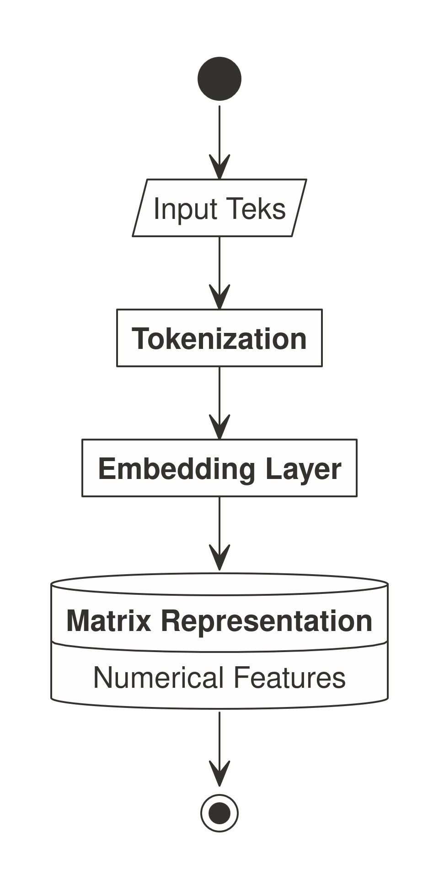

# Read Me!

- [Mukadimah](#mukadimah)
- [*Setting* Awal](#setting-awal)
  - [Tahap 1](#tahap-1)
  - [Tahap 2](#tahap-2)
  - [Tahap 3](#tahap-3)
  - [Catatan Khusus](#catatan-khusus)
- [**Ellmer** dan **Ragnar**](#ellmer-dan-ragnar)
- [*Key Concept*](#key-concept)
  - [*Embedding*](#embedding)

# Mukadimah

*Workshop* kali ini kita akan membahas tentang LLM di **R**, mulai dari
LLM *open source* dari **Huggingface** hingga LLM komersial seperti
**OpenAI** dan **DeepSeek**.

Apa saja yang bisa dilakukan menggunakan LLM?

1.  *Text clustering*.
2.  *Retrieval augmented generation* (RAG).
3.  *and many more*.

# *Setting* Awal

Sebelum mulai, kita memerlukan *setting* awal khusus agar bisa melakukan
komputasi model **Huggingface** di *local computer* menggunakan **R**,
kita perlu membuat *virtual python environment* dengan cara sebagai
berikut:

## Tahap 1

Masuk ke `terminal` sebagai *super user*.

    sudo su

## Tahap 2

Pastikan *python* sudah ter-*install* lalu lakukan *update* sebagai
berikut:

    # kita update dan upgrade sistem linux nya
    apt update
    apt upgrade -y

    # kita akan install python3 environment terlebih dahulu
    apt install python3-venv
    python3 -m venv .env
    source .env/bin/activate

## Tahap 3

*Install library* `transformers` pada *local computer* sebagai berikut:

    # proses install transformers dan torch
    pip install transformers
    pip install 'transformers[torch]'
    pip install diffusers["torch"] transformers
    pip install protobuf
    pip install pandas

Saya melakukan instalasi menggunakan perintah `pip`. Jadi pastikan `pip`
sudah ter-*install* terlebih dahulu.

## Catatan Khusus

Hal ini perlu dilakukan ulang setiap kali kita berpindah *working
directory*.

# **Ellmer** dan **Ragnar**

Kita akan *exploit* kegunaan `ellmer` dan `ragnar` pada *workshop* ini.
Pastikan sudah ter-*install* dan kita memiliki salah satu dari **API
Key** **DeepSeek** atau **OpenAI**.

# *Key Concept*

Untuk bisa melakukan *text analysis* ataupun **RAG**, ada satu
***step*** yang wajib dilakukan, yakni proses *embedding*.

## *Embedding*

Apa itu proses *embedding*?

*Embedding text* adalah proses transformasi teks menjadi representasi
numerik padat (vektor) yang menangkap makna semantik dan hubungan
kontekstual. LLM menggunakan *embedding* untuk memetakan kata/frasa ke
ruang vektor multidimensi dimana jarak geometris mencerminkan kesamaan
semantik. Proses ini memungkinkan model memahami konteks, melakukan
operasi matematika pada teks, dan mengidentifikasi pola tersembunyi
dalam data linguistik.

