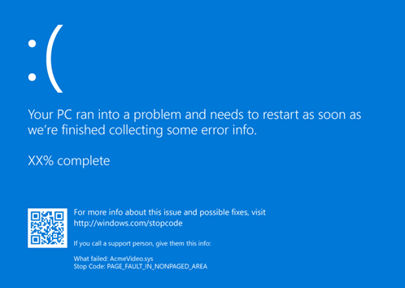
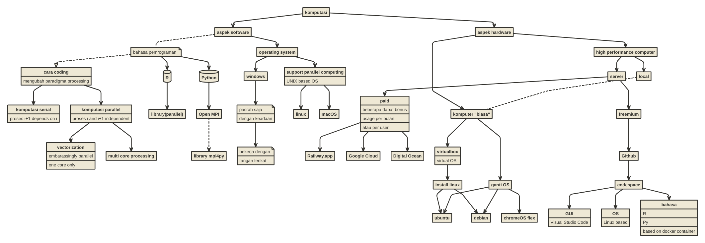

# BAGAIMANA MEMPERCEPAT KOMPUTASI?

Saya mulai dari pertanyaan berikut ini:

> Pernahkah Anda berhadapan dengan tampilan berikut ini?

Atau pertanyaan berikut ini:

> Pernahkan komputer Anda menjadi lemot dan tidak kuat saat nge-*run*
> skrip tertentu?

## Materi

## Pustaka

Saat kuliah lalu, beberapa tugas *parallel computating* menggunakan
*Python* saya sudah sematkan pada *folder* `Bahan Bacaan Python`.

Untuk **R**, bisa baca tulisan di *blog* saya [berikut
ini](https://ikanx101.com/blog/serial-parallel/).
